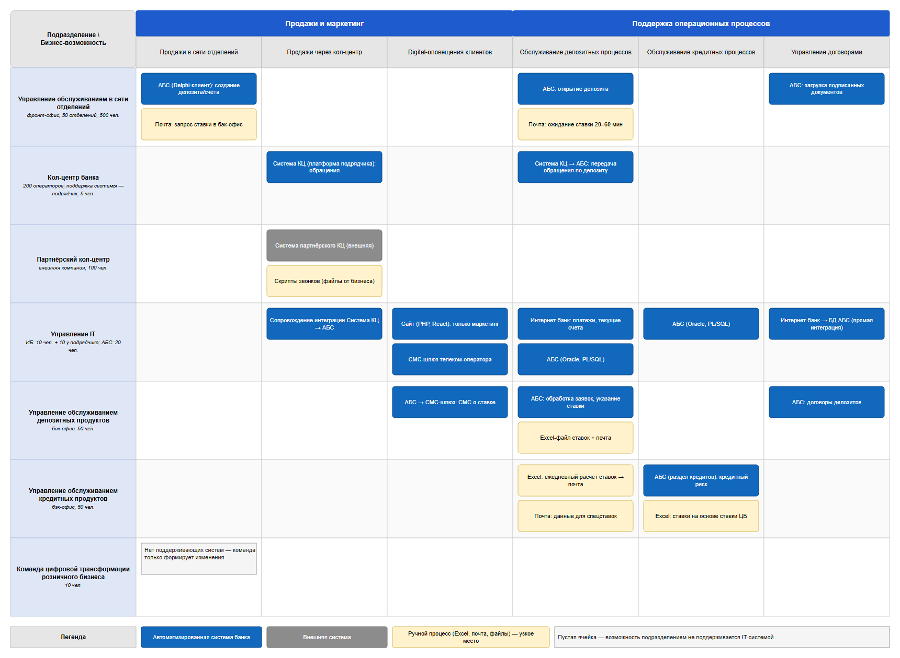
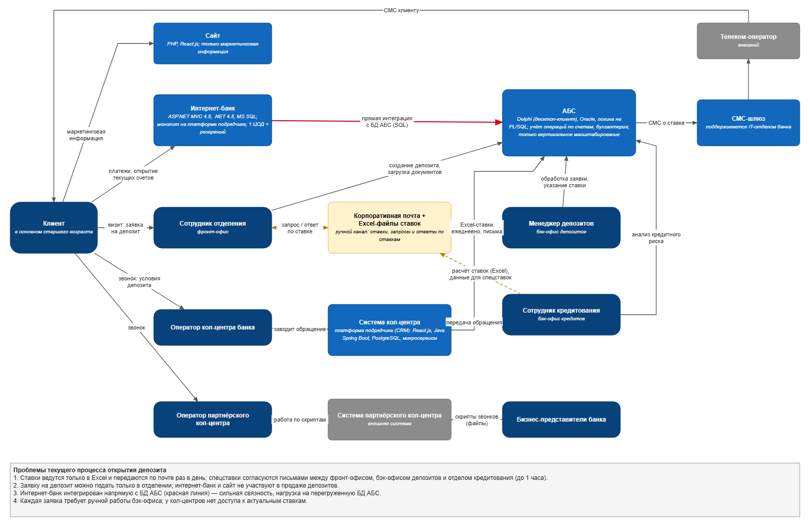

# Задание 1. Карта IT-ландшафта и схема интеграции приложений

| Артефакт | draw.io | Изображение |
|---|---|---|
| Карта текущего IT-ландшафта | [it-landscape-map.drawio](it-landscape-map.drawio) | [it-landscape-map.png](it-landscape-map.png) |
| Схема интеграции приложений с участниками процессов | [integration-scheme.drawio](integration-scheme.drawio) | [integration-scheme.png](integration-scheme.png) |

## Карта IT-ландшафта
Строки — элементы организационной структуры банка, колонки — бизнес-возможности второго уровня из Business Capability Map
(«Продажи и маркетинг»: продажи в сети отделений, продажи через кол-центр, digital-оповещения клиентов;
«Поддержка операционных процессов»: обслуживание депозитных процессов, обслуживание кредитных процессов, управление договорами).
В ячейках — IT-системы и инструменты, которыми подразделение реализует возможность. Жёлтым выделены ручные инструменты (Excel, почта, файлы) — узкие места процесса.

## Схема интеграции приложений (текущее состояние)
Показаны участники процесса открытия депозита (клиент, фронт-офис, операторы кол-центров, бэк-офисы депозитов и кредитов, бизнес-представители), системы и потоки данных между ними. Красным — прямая интеграция интернет-банка с БД АБС, жёлтым пунктиром — ручной обмен через почту и Excel.

## Что мешает сделать депозит полностью цифровым продуктом
1. **Нет системы ведения ставок.** Ставки рассчитываются вручную в Excel отделом кредитования и раз в день рассылаются почтой; спецставки согласуются цепочкой писем (фронт-офис → бэк-офис депозитов → кредитование и обратно) — до часа на клиента.
2. **Ручная обработка каждой заявки бэк-офисом** в АБС: нет правил автоматического определения ставки и открытия депозита.
3. **Онлайн-каналы не участвуют в продаже депозитов**: сайт показывает только маркетинговую информацию, интернет-банк умеет только платежи и текущие счета.
4. **Архитектурные ограничения**: интернет-банк интегрирован напрямую с БД перегруженной АБС, которая масштабируется только вертикально; интернет-банк — монолит на платформе подрядчика в одном ЦОД.
5. **Кол-центры не видят ставки**: банк и партнёр не могут проконсультировать клиента без запроса в бэк-офис.
6. **Требования безопасности**: сотрудники депозитов и кредитов не должны видеть данные друг друга, поэтому обмен идёт через почту — его нужно заменить ролевой моделью доступа в системе.
