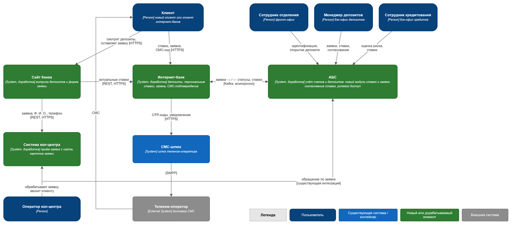
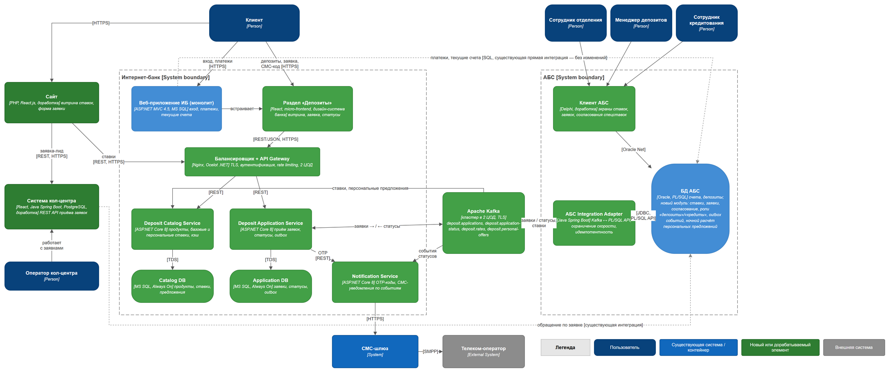

### **Название задачи:** Концептуальная архитектура MVP открытия депозитов онлайн (сайт и интернет-банк)
### **Автор:** Корюн Аванесян
### **Дата:** 07.10.2026

### **Функциональные требования**

Источник требований — FURPS+ таблица из [Task2](../Task2/FURPS+.md).

|**№**|**Действующие лица или системы**|**Use Case**|**Описание**|
| :-: | :- | :- | :- |
| 1 | Клиент (новый), Сайт, Deposit Catalog Service | Просмотр депозитов и ставок на сайте | 1. Клиент открывает страницу депозитов на сайте. 2. Сайт запрашивает продукты и базовые ставки у Deposit Catalog Service через публичный API Gateway (HTTPS). 3. Сервис отдаёт данные из кэша/Catalog DB без обращения к АБС. 4. Сайт показывает список депозитов и накопительных счетов с актуальными ставками. |
| 2 | Клиент (новый), Сайт, Система кол-центра | Подача заявки на депозит на сайте | 1. Клиент выбирает депозит и вводит Ф. И. О. и номер телефона. 2. Сайт валидирует данные (формат телефона, защита от ботов) и передаёт заявку по HTTPS в REST API приёма заявок системы кол-центра. 3. Система кол-центра создаёт заявку-лид и ставит её в очередь операторов. 4. Клиент видит подтверждение «Заявка принята, с вами свяжется менеджер». |
| 3 | Оператор кол-центра, Система кол-центра, АБС | Обработка заявки с сайта | 1. Оператор открывает заявку в системе кол-центра и видит выбранный депозит и актуальные ставки. 2. Звонит клиенту, рассказывает об условиях, при необходимости предлагает особые условия. 3. Приглашает клиента в отделение для идентификации. 4. По существующей интеграции система кол-центра передаёт обращение в АБС — сотрудники отделения и бэк-офиса видят заявку заранее. |
| 4 | Клиент (новый), Сотрудник отделения, АБС | Идентификация и открытие депозита в отделении | 1. Клиент приходит в отделение с документами. 2. Сотрудник находит обращение в АБС, идентифицирует клиента и заводит его в АБС. 3. Ставка берётся из модуля ставок АБС (без переписки по почте). 4. Сотрудник открывает депозит в АБС, клиент подписывает документы, сотрудник загружает их в АБС. |
| 5 | Клиент ИБ, Раздел «Депозиты», Deposit Catalog Service | Просмотр депозитов и персональных ставок в интернет-банке | 1. Авторизованный клиент открывает раздел «Депозиты». 2. Раздел запрашивает через API Gateway список продуктов, базовые ставки и персональные предложения клиента. 3. Deposit Catalog Service отдаёт данные из Catalog DB (персональные предложения заранее рассчитаны в АБС и получены из Kafka). 4. Клиент видит депозиты, базовые и персональные ставки. |
| 6 | Клиент ИБ, Deposit Application Service, Notification Service, СМС-шлюз | Подача заявки на открытие депозита в интернет-банке | 1. Клиент выбирает депозит, указывает счёт списания и сумму. 2. Deposit Application Service проверяет параметры (минимальная сумма, срок, остаток на счёте) и создаёт черновик заявки. 3. Сервис запрашивает у Notification Service одноразовый код; код уходит клиенту через СМС-шлюз. 4. Клиент вводит СМС-код, сервис проверяет его. 5. Заявка сохраняется в Application DB в статусе «Принята» и в той же транзакции записывается в outbox. 6. Событие публикуется в топик Kafka `deposit.applications`. 7. Клиент видит заявку со статусом «На рассмотрении». |
| 7 | АБС Integration Adapter, АБС, Менеджер депозитов, Сотрудник кредитования | Обработка заявки бэк-офисом и подтверждение ставки (MVP) | 1. АБС Integration Adapter читает заявку из Kafka и с ограничением скорости вызывает PL/SQL API АБС (идемпотентно по ID заявки). 2. Заявка появляется в очереди менеджера депозитов в клиенте АБС. 3. Менеджер подтверждает ставку по данным модуля ставок; для специальной ставки создаёт запрос в отдел кредитования. 4. Сотрудник кредитования в своём разделе АБС оценивает кредитный риск и возвращает результат (без доступа к данным депозитов). 5. Менеджер фиксирует ставку — статус «Ставка подтверждена». 6. Депозит открывается в АБС, средства списываются со счёта — статус «Депозит открыт» (или «Отклонена» с причиной). |
| 8 | АБС, АБС Integration Adapter, Kafka, Deposit Application Service, Notification Service | Уведомление клиента о статусе заявки | 1. АБС пишет изменение статуса в таблицу outbox. 2. Adapter публикует событие в топик `deposit.application-status`. 3. Deposit Application Service обновляет статус в Application DB — клиент видит его в интернет-банке. 4. Notification Service по событиям «Ставка подтверждена» и «Депозит открыт» отправляет клиенту СМС через СМС-шлюз. |
| 9 | Менеджер депозитов, Сотрудник кредитования, АБС, Kafka, Deposit Catalog Service | Ведение ставок и публикация в каналы | 1. Сотрудник кредитования ежедневно вводит в модуль ставок АБС параметры (ставка рефинансирования ЦБ, уровень кредитного риска). 2. Менеджер депозитов утверждает базовые ставки по продуктам. 3. Ночной расчёт в АБС формирует персональные предложения для клиентов ИБ. 4. Adapter публикует ставки в `deposit.rates`, а предложения — в `deposit.personal-offers`. 5. Deposit Catalog Service обновляет Catalog DB и сбрасывает кэш; сайт и интернет-банк показывают новые ставки. |

### **Нефункциональные требования**

|**№**|**Требование**|
| :-: | :- |
| 1 | Доступность сервисов интернет-банка и сайта — 24/7, не ниже 99,9 %; новые сервисы, Kafka и MS SQL работают в двух ЦОД, переключение автоматическое (RPO ≤ 5 мин, RTO ≤ 15 мин). |
| 2 | Интернет-банк не обращается к API и БД АБС напрямую в новом процессе: обмен только асинхронный, через Kafka; АБС забирает заявки в своём темпе. |
| 3 | Приём заявок продолжает работать при недоступности АБС; заявки доставляются после её восстановления без потерь и дублей (outbox, at-least-once, идемпотентность по ID заявки). |
| 4 | Время отклика: p95 ≤ 300 мс для чтения продуктов, ставок и справочников; p95 ≤ 1 с для подачи заявки. Справочные данные отдаются из кэша. |
| 5 | Горизонтальное масштабирование stateless-сервисов; балансировка запросов между экземплярами и ЦОД; выдерживается 10-кратный пик нагрузки во время маркетинговых кампаний. |
| 6 | Шифрование: TLS 1.2+ для сайта и интернет-банка, TLS/mTLS между сервисами, TLS + SASL для Kafka; персональные данные не пишутся в логи. |
| 7 | Подтверждение операции одноразовым СМС-кодом: срок жизни 5 минут, не более 3 попыток; отправка через существующий СМС-шлюз без доработки ядра интернет-банка. |
| 8 | Ролевой доступ в модуле ставок АБС: сотрудники бэк-офисов депозитов и кредитов не видят данные друг друга. |
| 9 | Используются имеющиеся в банке технологии: .NET (ASP.NET Core), MS SQL, Oracle/PL-SQL, Java Spring Boot, React; новая технология — только Kafka. |
| 10 | UI соответствует дизайн-системе банка и адаптирован для клиентов старшего возраста и мобильных устройств. |
| 11 | Документация: OpenAPI для REST API, AsyncAPI для топиков Kafka, ADR и C4-диаграммы. Централизованные логи, метрики и трассировка. |
| 12 | Расширяемость: архитектура позволяет перейти к автоматическому открытию депозитов (через год) и добавить кредитные заявки без переработки интеграции. |

### **Решение**

**Диаграммы** (исходники draw.io + PNG):
- C4 Context — [c4-context.drawio](c4-context.drawio) / [c4-context.png](c4-context.png)
- C4 Container (детализированы интернет-банк и АБС) — [c4-container.drawio](c4-container.drawio) / [c4-container.png](c4-container.png)

Зелёным на диаграммах выделены новые и дорабатываемые элементы, синим — существующие без изменений.

**Основные компоненты и интеграции**

| Система / контейнер | Технология | Ответственность | Команда |
| :- | :- | :- | :- |
| Раздел «Депозиты» | React, micro-frontend, дизайн-система банка | UI витрины, заявки, СМС-подтверждения и статусов; встраивается в монолит ИБ | ИБ (банк) |
| Веб-приложение ИБ (монолит) | ASP.NET MVC 4.5, MS SQL | Без изменения ядра: аутентификация клиента, точка встраивания раздела «Депозиты» | ИБ (банк), подрядчик — только консультации |
| Балансировщик + API Gateway | Nginx, Ocelot (.NET) | TLS-терминация, проверка токена сессии ИБ, маршрутизация, rate limiting; публичный read-only API ставок для сайта; балансировка между экземплярами и ЦОД | ИБ + инфраструктура |
| Deposit Catalog Service + Catalog DB | ASP.NET Core 8, MS SQL Always On | Продукты, базовые ставки, персональные предложения; локальная копия данных из Kafka + in-memory кэш → ответы за миллисекунды без нагрузки на АБС | ИБ (банк) |
| Deposit Application Service + Application DB | ASP.NET Core 8, MS SQL Always On | Приём и валидация заявок, проверка OTP, хранение статусов, transactional outbox → Kafka | ИБ (банк) |
| Notification Service | ASP.NET Core 8 | Генерация и проверка OTP, СМС по событиям статусов через существующий СМС-шлюз (обходит ядро ИБ) | ИБ (банк) |
| Apache Kafka | кластер в 2 ЦОД | Асинхронная шина: `deposit.applications`, `deposit.application-status`, `deposit.rates`, `deposit.personal-offers` | IT / инфраструктура |
| АБС Integration Adapter | Java Spring Boot | Мост Kafka ↔ PL/SQL API АБС; контролирует скорость записи в АБС, обеспечивает идемпотентность, публикует события из outbox АБС | АБС (Java-специалисты) |
| Модуль ставок и заявок в АБС | Oracle, PL/SQL, Delphi | Ведение ставок вместо Excel, очередь онлайн-заявок, согласование (в т. ч. спецставок), ролевой доступ «депозиты»/«кредиты», outbox событий, ночной расчёт персональных предложений | АБС |
| Сайт | PHP, React.js | Витрина ставок (через API Gateway), форма заявки → система КЦ; HTTPS, защита от ботов | Сайт (банк) |
| Система кол-центра | React, Java Spring Boot, PostgreSQL | REST API приёма лидов с сайта, карточка заявки в UI оператора | Подрядчик КЦ / Java-специалисты АБС через механизмы расширения |

**Логика принятия решений**
1. **Не трогаем ядро интернет-банка.** Обновление ядра привязано к подрядчику, а .NET Framework 4.5 несовместим с Kafka. Поэтому депозитный функционал выносится в отдельные микросервисы на ASP.NET Core: команда ИБ уже владеет .NET, сервисы используют MS SQL, совместимы с Kafka и независимо релизятся. Монолит только встраивает новый раздел — это первый шаг к микросервисной архитектуре ИБ в рамках задачи депозитов.
2. **Разгружаем и изолируем АБС.** БД АБС перегружена и масштабируется только вертикально, поэтому интернет-банк не делает синхронных вызовов в АБС. Заявки идут через Kafka, а адаптер на стороне АБС записывает их с ограниченной скоростью. Чтение (ставки, предложения) обслуживается из локальной копии в Catalog DB. При недоступности АБС клиент всё равно может подать заявку.
3. **Kafka как стандарт интеграции.** Выбран бизнесом «на перспективу», даёт гарантированную доставку, повторное чтение и масштабирование. Через неё же в задании 4 ставки получают кол-центры, а в целевом состоянии — сервис автоматического открытия депозитов.
4. **Адаптер АБС на Java.** В команде АБС есть Java-специалисты; Spring Boot имеет зрелые клиенты Kafka и JDBC/Oracle. Логика АБС остаётся в PL/SQL, где её поддерживает команда.
5. **Ставки — в АБС.** Это единый источник для всех каналов. Сотрудники обоих бэк-офисов уже работают в АБС, а ролевой доступ решает требование безопасности, из-за которого сейчас используется почта.
6. **Персональные ставки рассчитываются заранее** (ночной батч в АБС → `deposit.personal-offers`): онлайн-запрос персональной ставки не создаёт нагрузку на АБС.
7. **Надёжность 99,9 %.** Stateless-сервисы в двух ЦОД за балансировщиком, MS SQL Always On, кластер Kafka с репликацией между ЦОД, outbox и идемпотентная обработка. Монолит ИБ в MVP остаётся в схеме «основной + резервный ЦОД» — риск зафиксирован ниже.
8. **СМС без ядра ИБ.** Notification Service работает напрямую с существующим СМС-шлюзом, поддерживаемым IT-отделом банка.
9. **Сайт не интегрируется с АБС.** Для нового клиента это лид, а не банковская операция. Сайт передаёт его в систему кол-центра, а ставки читает из того же Catalog Service, что и интернет-банк.

**Команды-участники:** ИБ (банк) — раздел «Депозиты», микросервисы, API Gateway; АБС — модуль ставок и заявок, экраны Delphi, Integration Adapter; инфраструктура IT — Kafka, балансировка, MS SQL Always On, второй ЦОД; команда сайта; подрядчик системы КЦ (или Java-специалисты АБС) — API приёма лидов; IT-отдел — СМС-шлюз (новый клиент-сервис); бизнес и бэк-офисы — ведение ставок, регламенты.

### **Альтернативы**

| Альтернатива | Почему отклонена |
| :- | :- |
| Синхронные вызовы API/БД АБС из интернет-банка (расширить текущую прямую интеграцию) | Увеличивает нагрузку на перегруженную БД АБС, связывает доступность ИБ с АБС (99,9 % недостижимо), противоречит требованию избегать прямой работы ИБ с АБС. |
| Реализовать депозиты внутри монолита ИБ | Платформа ИБ (.NET 4.5) несовместима с Kafka, доработки СМС требуют подрядчика, монолит не масштабируется горизонтально и живёт в одном ЦОД. |
| Отдельная новая система ставок вне АБС (Rates Engine на .NET) | Дублирует данные по кредитному риску, которые находятся в АБС; требует новой ролевой модели и интеграции. Целесообразно рассмотреть на этапе автоматизации (через год), если нагрузка на АБС вырастет. |
| RabbitMQ или очереди Oracle AQ вместо Kafka | Бизнес рекомендовал Kafka на перспективу; Kafka даёт долговременное хранение и повторное чтение событий для новых потребителей (кол-центры, аналитика). Oracle AQ нагружал бы ту же БД АБС. |
| Сайт отправляет заявку сразу в АБС | Для нового клиента в АБС ещё нет карточки; заявка требует звонка менеджера — естественное место для неё в системе кол-центра. |
| Покупка готового фронт-офисного банковского решения | Высокая стоимость и срок внедрения, не укладывается в 6 месяцев MVP. |

**Недостатки, ограничения, риски**

| Риск / недостаток | Последствие | Митигация |
| :- | :- | :- |
| Eventual consistency: ставки в Catalog DB обновляются с задержкой | Клиент может увидеть устаревшую ставку несколько секунд/минут | Версия ставки в заявке; АБС проверяет актуальность при обработке и уведомляет клиента об изменении; мониторинг задержки репликации |
| Новая технология — Kafka | Нужны компетенции эксплуатации, затраты на инфраструктуру в двух ЦОД | Обучение, на старте — managed-дистрибутив или поддержка вендора; AsyncAPI-документация |
| Распределённая система сложнее монолита | Сложнее отладка и сопровождение | Централизованные логи, трассировка по ID заявки, алерты на «застрявшие» заявки |
| Монолит ИБ остаётся в схеме «основной + резервный ЦОД» | Вход в ИБ (и, значит, в раздел «Депозиты») при аварии ЦОД доступен после ручного переключения | Регламент переключения; в целевом состоянии — вынос аутентификации в отдельный сервис и active-active |
| Нагрузка на АБС всё равно растёт (обработка заявок, батч персональных предложений) | Риск для основной системы банка | Adapter с rate limiting, батч ночью, нагрузочное тестирование, вертикальное масштабирование БД АБС по плану |
| В MVP заявки обрабатываются вручную бэк-офисом | Нет мгновенного открытия, при росте заявок нужна большая загрузка бэк-офиса | Целевое решение (12 мес.) — правила автоматического согласования ставки и открытия депозита в АБС |
| Зависимость от подрядчика системы КЦ для API приёма лидов | Сроки доработки | Использовать механизмы расширения платформы силами Java-специалистов АБС; ранний старт задачи |
| Доработки клиента АБС на Delphi | Ограниченная команда (20 человек) — узкое место дорожной карты | Приоритизация модуля ставок первым, т. к. от него зависят все каналы |
| Безопасность публичного API ставок и формы на сайте | Боты, спам-заявки, DDoS | Rate limiting на Gateway, CAPTCHA, WAF |
