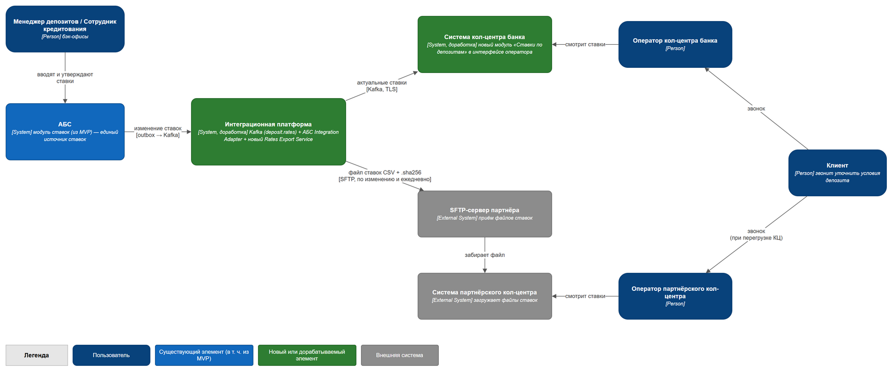
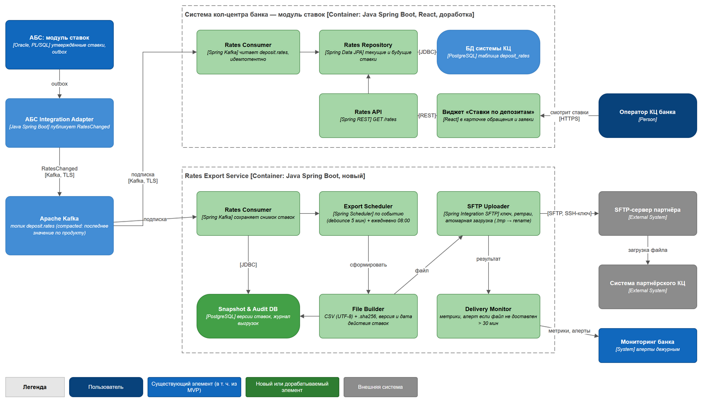
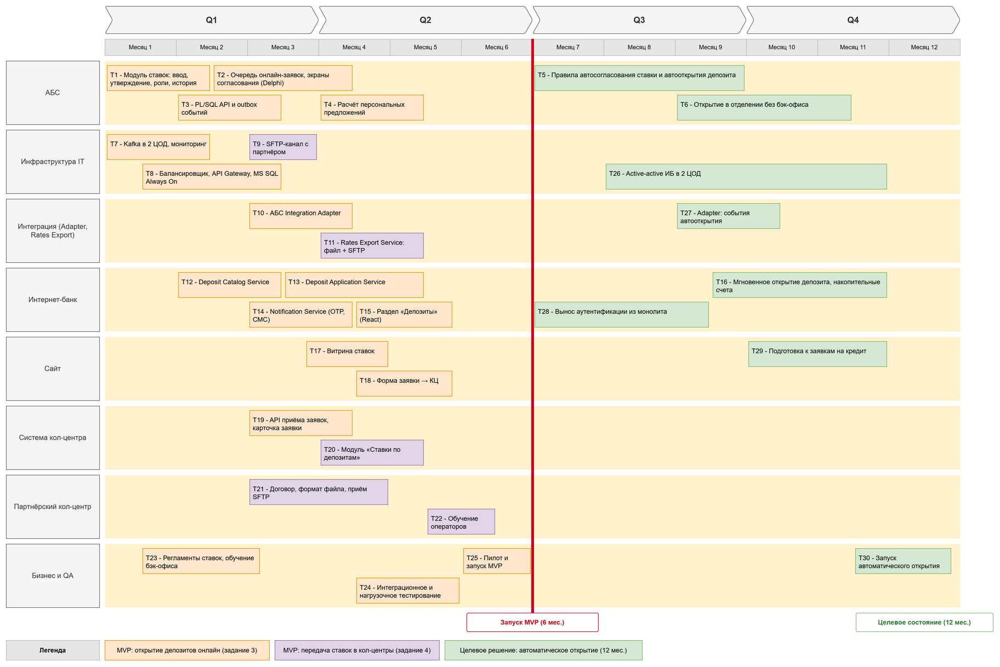

### **Название задачи:** Передача актуальных ставок по депозитам в кол-центр банка и партнёрский кол-центр
### **Автор:** Корюн Аванесян
### **Дата:** 07.10.2026

**Контекст.** Большинство клиентов банка — люди старшего возраста. После запуска онлайн-депозитов и маркетинговой кампании ожидается рост звонков с вопросами об условиях депозитов. Операторы кол-центра банка должны консультировать по актуальным ставкам. При перегрузке к работе подключается партнёрский кол-центр. Он работает во внешней информационной системе, не может вызывать API банка и готов получать ставки только в виде файлов. Решение опирается на MVP из [ADR задания 3](../Task3/ADR.md): ставки уже ведутся в модуле ставок АБС и публикуются в Kafka (топик `deposit.rates`).

### **Функциональные требования**

|**№**|**Действующие лица или системы**|**Use Case**|**Описание**|
| :-: | :- | :- | :- |
| 1 | Менеджер депозитов, Сотрудник кредитования, АБС, АБС Integration Adapter, Kafka | Публикация изменения ставок | 1. Сотрудник кредитования вводит параметры риска, менеджер депозитов утверждает базовые ставки в модуле ставок АБС. 2. АБС записывает событие `RatesChanged` (полный перечень ставок по продуктам, версия, дата начала действия) в outbox. 3. Adapter публикует событие в compacted-топик `deposit.rates` (ключ — код продукта). |
| 2 | Система кол-центра (модуль ставок), Kafka | Получение ставок системой кол-центра банка | 1. Rates Consumer в системе КЦ читает `deposit.rates`. 2. Идемпотентно (по версии) сохраняет текущие и будущие ставки в PostgreSQL системы КЦ. 3. При старте или восстановлении перечитывает топик с начала и получает актуальное состояние. |
| 3 | Оператор кол-центра банка, Система кол-центра | Консультация клиента по ставкам | 1. Клиент звонит в кол-центр. 2. Оператор открывает виджет «Ставки по депозитам» в карточке обращения или заявки с сайта. 3. Видит базовые ставки по продуктам, срокам и суммам, дату и время обновления, ставки, вступающие в силу в будущем. 4. Консультирует клиента и при необходимости заводит заявку или приглашает в отделение. |
| 4 | Rates Export Service, Kafka, SFTP-сервер партнёра | Выгрузка файла ставок партнёру | 1. Rates Export Service получает новую версию ставок из `deposit.rates` и сохраняет снимок. 2. Через 5 минут после последнего изменения (debounce) и ежедневно в 08:00 формирует файл `deposit_rates_<дата>_<версия>.csv` (UTF-8) и контрольную сумму `.sha256`. 3. Загружает файлы на SFTP партнёра по SSH-ключу атомарно (`.tmp` → переименование). 4. Записывает результат в журнал выгрузок. |
| 5 | Система партнёрского кол-центра, Оператор партнёрского кол-центра | Консультация по ставкам в партнёрском кол-центре | 1. Система партнёра забирает новый файл с SFTP, проверяет контрольную сумму и загружает ставки. 2. Оператор партнёра при звонке клиента видит актуальные ставки и дату их обновления. 3. Консультирует клиента по скрипту, переданному бизнес-представителями банка. |
| 6 | Delivery Monitor, Мониторинг банка, дежурная смена IT | Контроль доставки ставок | 1. Delivery Monitor отслеживает задержку между версией ставок в АБС и последним доставленным файлом. 2. Если файл не доставлен более 30 минут или загрузка завершилась ошибкой после ретраев, создаётся алерт. 3. Дежурный устраняет проблему или инициирует повторную выгрузку; бизнес уведомляет партнёра. |

### **Нефункциональные требования**

|**№**|**Требование**|
| :-: | :- |
| 1 | Актуальность: ставки появляются в системе кол-центра банка не позднее 1 минуты, а у партнёра — не позднее 15 минут после утверждения в АБС. Ежедневный полный файл в 08:00 — даже без изменений. |
| 2 | Единый источник ставок — модуль ставок АБС; ни один кол-центр не хранит ставки, введённые вручную. |
| 3 | Нагрузка на АБС не растёт: кол-центры не обращаются к АБС, данные читаются из Kafka. |
| 4 | Доступность модуля ставок в системе КЦ — 99,9 %, в режиме 24/7; при недоступности Kafka оператор видит последние сохранённые ставки с датой обновления. |
| 5 | Гарантированная доставка: at-least-once, идемпотентность по версии ставок, ретраи выгрузки на SFTP, журнал доставок. |
| 6 | Безопасность: TLS + SASL для Kafka, SFTP с аутентификацией по ключу и белым списком IP, контрольная сумма файла; файл содержит только публичные базовые ставки, без персональных данных и персональных ставок клиентов. |
| 7 | Партнёр не получает доступа к внутренним системам банка; обмен только исходящий из DMZ банка. |
| 8 | Формат файла документирован и версионирован (спецификация CSV, AsyncAPI для `deposit.rates`); изменения формата согласуются с партнёром заранее. |
| 9 | Наблюдаемость: метрики задержки доставки, алерты дежурной смене, аудит выгрузок не менее 1 года. |
| 10 | Используются имеющиеся в банке технологии: Java Spring Boot и PostgreSQL (стек системы КЦ), Kafka из MVP. |

### **Решение**

**Диаграммы** (исходники draw.io + PNG):
- C4 Context — [c4-context.drawio](c4-context.drawio) / [c4-context.png](c4-context.png)
- C4 Component — [c4-component.drawio](c4-component.drawio) / [c4-component.png](c4-component.png)

На диаграммах показаны только элементы, значимые для передачи ставок. Интернет-банк, сайт и обработка заявок не меняются и описаны в ADR задания 3.

**Компоненты решения**

| Элемент | Технология | Ответственность |
| :- | :- | :- |
| Модуль ставок АБС (из MVP, T1/T3) | Oracle, PL/SQL | Единый источник ставок; событие `RatesChanged` в outbox при утверждении |
| АБС Integration Adapter (из MVP, T10) | Java Spring Boot | Публикация `RatesChanged` в compacted-топик `deposit.rates` |
| Модуль «Ставки по депозитам» в системе КЦ (новый, T20) | Java Spring Boot, PostgreSQL, React | Rates Consumer → Rates Repository → БД системы КЦ; Rates API; виджет в интерфейсе оператора |
| Rates Export Service (новый, T11) | Java Spring Boot, PostgreSQL | Rates Consumer, Snapshot & Audit DB, Export Scheduler, File Builder, SFTP Uploader, Delivery Monitor |
| SFTP-канал (T9) | SFTP, SSH-ключи, DMZ | Исходящая доставка файлов партнёру |

**Формат файла для партнёра** (`deposit_rates_YYYYMMDD_HHMM_v<версия>.csv`, UTF-8, разделитель `;`):
`version;effective_from;product_code;product_name;term_months;min_amount;max_amount;currency;rate_percent;capitalization;early_withdrawal`, плюс файл `.sha256` с контрольной суммой.

**Логика принятия решений**
1. **Переиспользуем MVP.** Ставки уже ведутся в АБС и публикуются в Kafka для интернет-банка. Кол-центры становятся ещё двумя подписчиками того же топика — это не требует новых интеграций с АБС и не нагружает её.
2. **Кол-центр банка — через Kafka.** Система КЦ построена на Java Spring Boot с микросервисной архитектурой и допускает расширение. Java-специалисты команды АБС могут сами добавить микросервис-подписчик и виджет, не дожидаясь подрядчика. Compacted-топик позволяет при старте получить последнее состояние всех ставок.
3. **Партнёр — через файлы по SFTP.** У партнёра нет возможности вызывать API, но он готов принимать файлы. Push-модель с SFTP и контрольной суммой — стандартный безопасный способ файлового обмена. Банк контролирует момент доставки и видит ошибки. CSV понятен любой системе и легко загружается.
4. **Выгрузка по событию + ежедневно.** Debounce 5 минут объединяет серию правок в один файл. Ежедневный файл в 08:00 гарантирует, что у партнёра всегда есть файл за текущий день, даже если ставки не менялись.
5. **Отдельный Rates Export Service**, а не логика в адаптере АБС: выгрузку партнёрам можно масштабировать и изменять (новые партнёры, форматы) без риска для интеграции заявок.
6. **Передаём только публичные базовые ставки**, без персональных данных и персональных предложений: минимизация данных во внешней системе. Особые условия по-прежнему согласуются через банк.

**Изменения по системам** — список крупных задач: [tasks.md](tasks.md); последовательность — [RoadMap](RoadMap.drawio) ([PNG](RoadMap.png)).

### **Альтернативы**

| Альтернатива | Почему отклонена |
| :- | :- |
| Сохранить ручной процесс: Excel со ставками по почте в оба кол-центра | Ручной труд, риск ошибок и устаревших ставок, нет контроля доставки, передача файлов по почте небезопасна. |
| Система КЦ читает ставки напрямую из БД АБС или через синхронный API АБС | Дополнительная нагрузка на перегруженную АБС, сильная связность, нарушает принцип MVP «никто не ходит в АБС синхронно». |
| Система КЦ запрашивает ставки по REST у Deposit Catalog Service ИБ | Возможно, но связывает кол-центр с доступностью ИБ; Kafka уже есть, подписка проще и устойчивее. Оставлено как запасной вариант. |
| Веб-портал ставок для операторов партнёра (read-only страница) | Требует доступа партнёра в периметр банка и учётных записей для 100 внешних операторов; партнёру удобнее видеть ставки в своей системе. |
| Партнёр забирает файл с SFTP банка (pull) | Банк не контролирует момент получения файла; требует входящего доступа в DMZ банка. Допустимо, если у партнёра нет своего SFTP. |
| Отправка файла по e-mail | Небезопасно, нет гарантий доставки и автоматической загрузки. |

**Недостатки, ограничения, риски**

| Риск / недостаток | Последствие | Митигация |
| :- | :- | :- |
| Задержка у партнёра: файл обрабатывается его системой по расписанию, на которое банк не влияет | Оператор партнёра может назвать устаревшую ставку | SLA в договоре (загрузка не позднее 15 минут); дата начала действия ставок в файле; будущие ставки передаются заранее; скрипт «ставка уточняется при оформлении» |
| Сбой SFTP-канала или сервера партнёра | Партнёр остаётся без новых ставок | Ретраи, алерт через 30 минут, ручная повторная выгрузка, ежедневный полный файл |
| Зависимость от внешней компании (формат, сроки, качество загрузки) | Срыв сроков MVP-4 | Ранний старт T21, простой CSV-формат, тестовый обмен до запуска |
| Доработка системы КЦ на платформе подрядчика | Возможен конфликт с обновлениями платформы | Использовать штатные механизмы расширения, согласовать с подрядчиком, отдельный микросервис |
| Файл с коммерческими условиями во внешней системе | Утечка ставок до их публикации | Передаём только утверждённые публичные ставки; будущие ставки — по согласованию с бизнесом; NDA |
| Дополнительный сервис и топик в эксплуатации | Рост операционной нагрузки на IT | Мониторинг и алерты, единый стек Java/Kafka, runbook для дежурных |
| Операторы консультируют только по базовым ставкам | Персональные и специальные условия по-прежнему требуют обращения в банк | Заявка из кол-центра → онлайн-заявка/отделение; в целевом состоянии — автоматический расчёт персональной ставки |
